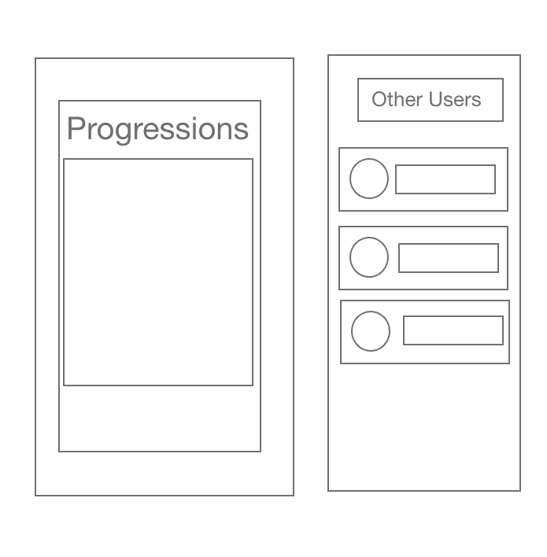

# Musical Training Application

>  "Sometimes you have to create a vision, a path for a vision. It may not be apparent, and you may have to forge it yourself. And that will be the way to move your life forward."    
>
> **Herbie Hancock**

Often times I ask myself about my Five Year plan and how it can relate to my future success. I have always struggled with two passions that have never held down my imagination or caged my ambitions and those two passions are **Music/Art** and **Programming**. I enjoy expressing myself in creative ways. Often these two elements people enjoy aren't woven together and I find it hard to practice both while not enjoying one of the other. 

This brings me right into my project proposal, I plan on developing and deploying a simple Android Application that will help those who struggle with managing their busy lives learning new Libraries and Programming Techniques but also enjoying the benefits of a **Thirty Minute** practice session and improve on their existing skills. 

## Motivation for My Application
------------------------------------

I recently traveled to the **Moog Music Store** located in Ashville, North Carolina. It was amazing inside they have alot of demo equipment and technology you can use, There was a lot of **expensive** and **Magnificient** Gear all free for Impromptu Jam Sessions. 

Priced out of most of the Synth Gear, I checkedout of the Small good section towards checkout, after purchasing an awesome `$20.00` T-shirt. I Snagged a **Random Music Progressions Card Deck from Tonic** the Deck promised to help improve your composition and softskills for session musicians. This is true, after picking up the deck and pulling a random card for a few weeks daily over the spring break of 2018 I found myself loving the idea of incorperating random programable pratice into my early morning coffee sessions before heading out to band practice in the afternoon. 

I found that this technique was workable through many instrument. I myself the previous Summer impulisvly purchased a Banjo and Learn the basics in a few weeks from a Chord Book and Thoght What if these progressions could help imporove my Banjo Skills. No Suprises there they did.

I thought lets try to make an application for this and Here is mty strategy for completing this. 

# Meeting Minimum requirements

## User Interfaces:

**Difficulty Selector**

The user interface will consist of an `Easy/Medium/Hard Mode`. I plan on featuring a View with a Difficult. After Years of Playing Piano and Guitar I know the basics Key Signatures each member should know on most of their steps to becoming a **Jedi Knight Shredder** on Guitar. This will help maintain confidence in the player and make the app more goal oriented.  

With the Strategy of helping the player progress in what ever instrument they choose. 

**The Key Signature Wheel**

I case you aren't familiar with music composition, let me give you the basics. the styles of music are performed in Keys Below is the Oh Sooo Sacred and Immediatly intimidating
**Circle of 5ths**

I plan on making the app interactive and fun by offering the user a chance to spin the *Burning Ring of Fire* Making a Circle of Fifths for the user to spin in order to allow the application to choose a key signature in which they will need to pratice in order to advance their skills.

**Easy Mode**

This Feature will only feature the Basic Keys Keys with one or Two (Sharps/Flats) *accidentals*. 

**Medium Mode**

This Feature will only feature the Basic Keys Keys with one or Two (Sharps/Flats) *accidentals*. as Well as Minor Key Equivalents. 

**Hard Mode**

This Feature will only feature the Basic Keys Keys with one or Two (Sharps/Flats) *accidentals*. as Well as Minor Key Equivalents. As well as Extended Chords. And Basic Genre Selection.

**Progressions Displays**

The Progressions will be filtered based on the user's difficulty selection in the previous state and if you have proven yourself your ability to perform.

## Data Persistence 
------------------------

**Progress Tracking** 

>"Practice isnt the thing you do once you're good It's the thing you do that makes you good."
>
>Malcolm Gladwell

**Tracking Practice**

 Practice is important and improving skills as a Musician are barely felt without the pain and pleasure of seeing the blisters on your fretting hand get more calase and strong as you conqure your goals and play in that new interesting key. Malcolm Gladwell, Once wrote in his Book *"Outliners"* that it takes 10,000 Hours to become an expert. Although time could be tracked on the app. it might be easier to use the track progress feature.

 Tracking your Progress by storing sessions and Spins will help the user's gain an understanding into the areas which will need improvement in the case of guitar shapes and calase development. Or the Finger possitions of the Piano.

## Outside World Communication
----------------------------------

**Progression Tracking**

Communcation with the outside world will be done with the ability to compare your rank amongst other users. Overall feeling like a rockstar compared to others will give you some bragging rights. amongst friends and other musicans and with great power comes great responsibility, and with the confidence users willl get from knowing they are practicing towards their own improvement it will allow others to see their skills and those with much more practice stats the confidence to perhaps help assist others in learning.

## MVC Breakdown Plans
-----------------------

 ## View Descriptions

 **Sign-in** 

 gives each User a login screen with the ability add their Full name and Email for progress tracking. Using Firebase for user entries

 

 **Dificulty Selection**

 Users can then select from a

* Easy- This Feature will only feature the Basic Keys Keys with one or Two (Sharps/Flats) *accidentals*. 

* Medium- This Feature will only feature the Basic Keys Keys with one or Two (Sharps/Flats) *accidentals*. as Well as Minor Key Equivalents. 

* Hard- This Feature will only feature the Basic Keys Keys with one or Two (Sharps/Flats) *accidentals*. as Well as Minor Key Equivalents. As well as Extended Chords. And Basic Genre Selection.

 

 **Progression View**

The Progression view will be displayed to users after the user has logged their email and selected a Difficulty  for their profile and Then Ssun the Wheel (Circle of 5ths) to allow a progression to be displayed for their practice session on the next view. After the Key signature is picked The Progression will be displayed in a style like the example image below

The View will feature a title and the Corresponding Roman Numberals for the Case (Major/Minor) and the Main Key Signature's Starting Note. Progressions will be filtered from the Difficulty Selection on the prior Screen 

**Status View**

The Status View will show Progressions the user is able to acces through the Difficulty selection on the prior screen and all the Progressions they have played thus far. Because even the pros forget Roman Numeral Analaysis Skills

The View will also Feature a List of other's and The amount of Difficulty They are operating on as a guage of their progress and skills.

## Model Descriptions

### Sign-in View

 **Classes**   

 * Will be used for the storage of elements to the Firebase DB, They will also hold specific profile information for the user of the application with Google Firebase Authentication

**Logic** 

 * As well as Login Buttons Which will change the ViewModel to the Login Screen where it will prompt for userdata

**Methods**

* Login Handler for the Login-Events
* onCreate For the Sign-in Viewmodel will need to be coded in order to handle the Firebase Storage and Access to Specific User Tables with Firebase
* Authorize data access for the Users Via Firebase Auth with Email

 ### Difficulty Selection & Spin View

**Classes**

* Objects to Build the appropriate Views based on the difficulty of the Musical Progressions

* Specific Classes will be used to Represent Databases with the Tables that will feature the appropraite Progressions based on the Class

**Logic**

* Pass the ViewModel for the appropriate Class difficulty.
*Handle the view of the Program based on the Client difficulty selection

**Methods**

* OnCreate Attribtues for the Selected difficulty class
* Retrieval of the appropraite DB based on the client selection of difficulty
*  Passing the Keysignature to the Next ViewModel to display the Progression

 ### Progression View

 ## Controller 
 --------------------

Each View will have their own Classes that help contribute to passing variables and states to other parts of the application.

**OnCreate**

* Will Initialize a User Object, This Object will then be stored in the Firebase Database with User Authentication. 

* Rotation will maintain another view which will maintain the state of the application

**OnPause**

* Depending on the View the Contoller will Allow for the Saving of the current state of the **Circle of Fifths** and the Progression which will be feature after. There will be a Counter for the amount of time the Progression in particular was featured on the user's list.

**OnDestroy**

* The Application will Push the state of the user's History to the Firestore Database and maintain the current counts of the progressions which the user has taken. 

* The History should be pushed to the Firestore DB before closing. 

**Application Layouts**

The Application is intended to operate in both *Landscape* and *Portrait View*. The Application will feature the same layout for all devices scaling the Viewmodels and Classes with the same constraints to the appropraite scale

